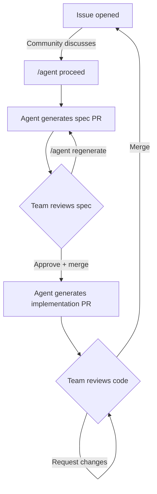

# Agent Flow

A drop-in boilerplate that enables community-driven, AI-assisted development using only GitHub Actions and the Claude API. No external servers or services required.

## How It Works



**Phase 1: Spec** — Someone posts `/agent proceed` on an issue. A GitHub Action reads the full issue thread and relevant repo files, calls Claude, and opens a PR with a spec file at `features/issue-{number}.md`. The team reviews and comments. Posting `/agent regenerate` on the spec PR triggers a new commit with an updated proposal. Approve and merge to move to phase 2.

**Phase 2: Implementation** — Triggered automatically when a spec PR is merged. The agent reads the approved spec from `features/`, builds deeper repo context, calls Claude, and opens a draft implementation PR. The team can pull the branch and continue work manually (e.g., with Claude Code), or review and merge as-is.

## Setup

1. **Copy the `.github/` directory** into your repository (or fork this repo).

2. **Add your Anthropic API key** as a repository secret:
   - Go to Settings > Secrets and variables > Actions
   - Add a secret named `ANTHROPIC_API_KEY`
   - `GITHUB_TOKEN` is provided automatically by GitHub Actions

3. **Configure allowed users** (important for public repos!) and customize `.github/agent/config.yml`:

```yaml
# Describe your tech stack
stack: "Next.js + TypeScript frontend, Python/FastAPI backend"

# Who can trigger /agent commands (empty = anyone — NOT recommended for public repos)
allowed_users:
  - "your-username"
  - "trusted-contributor"

# Files to always include in agent context
always_include:
  - "README.md"
  - "package.json"
  - "pyproject.toml"

# Auto-assign reviewers to agent PRs
reviewers:
  - "your-username"

# Claude model (default: claude-sonnet-4-20250514)
model: "claude-sonnet-4-20250514"

# Token budget for repo context
max_context_tokens: 80000
```

4. **Optionally customize the prompts** in `.github/agent/spec-prompt.md` and `.github/agent/implement-prompt.md`.

## Usage

1. **Open an issue** describing a feature, bug fix, or change.
2. **Discuss** in the issue comments — the more context, the better the spec.
3. **Post `/agent proceed`** when ready. The agent generates a spec PR.
4. **Review the spec PR**. Leave comments on what to change.
5. **Post `/agent regenerate`** on the spec PR to update it based on feedback.
6. **Approve and merge** the spec PR when satisfied.
7. **A draft implementation PR** is automatically created.
8. **Review, test, and merge** the implementation (or pull the branch to continue development).

## Configuration Reference

| Key | Description | Default |
|-----|-------------|---------|
| `stack` | Description of your tech stack | *(required)* |
| `allowed_users` | GitHub usernames allowed to trigger agent commands | `[]` (anyone) |
| `always_include` | Files always included in agent context | `["README.md"]` |
| `reviewers` | GitHub usernames for PR review assignment | `[]` |
| `triggers.proceed` | Command to trigger spec generation | `/agent proceed` |
| `triggers.regenerate` | Command to trigger spec regeneration | `/agent regenerate` |
| `model` | Claude model identifier | `claude-sonnet-4-20250514` |
| `max_context_tokens` | Token budget for repository context | `80000` |

## File Structure

```
.github/
  workflows/
    agent-spec.yml              # Handles /agent proceed and /agent regenerate
    agent-implement.yml         # Triggered by spec PR merge
  agent/
    config.yml                  # Project configuration
    spec-prompt.md              # System prompt for spec generation
    implement-prompt.md         # System prompt for implementation
    build-context.ts            # Smart file picker for repo context
    parse-config.ts             # Config parser for workflow steps
    build-context.test.ts       # Tests for build-context
    parse-config.test.ts        # Tests for parse-config
    package.json                # Script dependencies (js-yaml, tsx)
features/                       # Spec files (features/issue-123.md)
```

## Requirements

- A GitHub repository with Actions enabled
- An `ANTHROPIC_API_KEY` secret
- Node.js 22+ (installed automatically via `actions/setup-node` in CI)

## License

MIT
