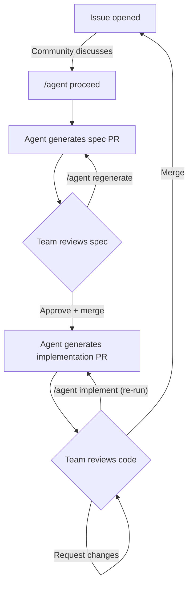

# Agent Flow

A drop-in boilerplate that enables community-driven, AI-assisted development using only GitHub Actions and [Claude Code](https://github.com/anthropics/claude-code-action). No external servers or services required.

## How It Works



**Phase 1: Spec** — Someone posts `/agent proceed` on an issue. A GitHub Action runs Claude Code in the runner, passes it the issue thread, and lets it explore the repository with Read/Glob/Grep. Claude writes a spec file to `features/issue-{number}.md`, and the workflow opens a PR. The team reviews and comments. Posting `/agent regenerate` on the spec PR triggers a rerun with the review feedback as input. Approve and merge to move to phase 2.

**Phase 2: Implementation** — Triggered automatically when a spec PR is merged, or manually by posting `/agent implement` on the source issue. The workflow:

1. **Scaffold & implement** — Claude reads the spec, scaffolds the project if the repo is empty (`rails new`, `npm create vite@latest`, etc.), then implements the spec against the codebase.
2. **`.gitignore` review** — a second focused Claude pass audits `.gitignore` and adds any missing entries (dependencies, build output, env files) before anything gets staged.
3. **Run tests** — the workflow detects the stack (package.json, Gemfile, pyproject.toml, go.mod, Cargo.toml) and runs the canonical test command. Results are included in the PR body, but failures don't block PR creation.
4. **Safety checks** — a secrets guard hard-fails if files matching dangerous names (`.env`, `*.key`, `*.pem`, etc.) would be committed, and a file-count sanity check aborts if the commit exceeds 600 files (typically a runaway `node_modules/` from a missing `.gitignore` entry).
5. **Open draft PR** — the workflow commits, pushes, and opens a draft PR. The commit message and PR body include the spec revision SHA so reviewers can confirm which version of the spec was implemented.

If something went wrong (bad implementation, stale prompt, test failures), post `/agent implement` on the source issue to re-run. The stale branch and draft PR are closed automatically before the fresh run starts.

Both phases use [`anthropics/claude-code-base-action`](https://github.com/anthropics/claude-code-base-action), which runs the real Claude Code agentic loop in the runner — not a one-shot API call. This means Claude can iteratively explore the repo, read exactly the files it needs, and write output directly rather than producing a single text blob that has to be parsed.

## Setup

1. **Copy the `.github/` directory** into your repository (or fork this repo).

2. **Add your Anthropic API key** as a repository secret:
   - Go to Settings > Secrets and variables > Actions
   - Add a secret named `ANTHROPIC_API_KEY`
   - `GITHUB_TOKEN` is provided automatically by GitHub Actions

3. **Configure allowed users** (important for public repos!) and customize `.github/agent/config.yml`:

```yaml
# Describe your tech stack
stack: "Next.js + TypeScript frontend, Python/FastAPI backend"

# Who can trigger /agent commands (empty = anyone — NOT recommended for public repos)
allowed_users:
  - "your-username"
  - "trusted-contributor"

# Auto-assign reviewers to agent PRs
reviewers:
  - "your-username"

# Claude model (default: claude-sonnet-4-20250514)
model: "claude-sonnet-4-20250514"
```

4. **Optionally customize the prompts** in `.github/agent/spec-prompt.md` and `.github/agent/implement-prompt.md`.

## Usage

1. **Open an issue** describing a feature, bug fix, or change.
2. **Discuss** in the issue comments — the more context, the better the spec.
3. **Post `/agent proceed`** when ready. The agent generates a spec PR.
4. **Review the spec PR**. Leave comments on what to change.
5. **Post `/agent regenerate`** on the spec PR to update it based on feedback.
6. **Approve and merge** the spec PR when satisfied.
7. **A draft implementation PR** is automatically created, with test results and the spec revision SHA in the body.
8. **Review, test, and merge** the implementation (or pull the branch to continue development).
9. **Re-run implementation** by posting `/agent implement` on the original issue — useful after tweaking `implement-prompt.md` or the workflow. The stale branch and draft PR are cleaned up automatically.

## Configuration Reference

| Key | Description | Default |
|-----|-------------|---------|
| `stack` | Description of your tech stack | *(required)* |
| `allowed_users` | GitHub usernames allowed to trigger agent commands | `[]` (anyone) |
| `reviewers` | GitHub usernames for PR review assignment | `[]` |
| `model` | Claude model identifier | `claude-sonnet-4-20250514` |

## File Structure

```
.github/
  workflows/
    agent-spec.yml              # Handles /agent proceed and /agent regenerate
    agent-implement.yml         # Triggered by spec PR merge
  actions/
    setup-agent/action.yml      # Shared setup (Node, deps, config loading)
  agent/
    config.yml                  # Project configuration
    spec-prompt.md              # Base instructions for spec generation
    implement-prompt.md         # Base instructions for implementation
    parse-config.ts             # Config parser for workflow steps
    parse-config.test.ts        # Tests for parse-config
    package.json                # Script dependencies (js-yaml, tsx)
features/                       # Spec files (features/issue-123.md)
```

## Requirements

- A GitHub repository with Actions enabled
- An `ANTHROPIC_API_KEY` secret
- Node.js 22+ (installed automatically via `actions/setup-node` in CI)

## License

MIT
